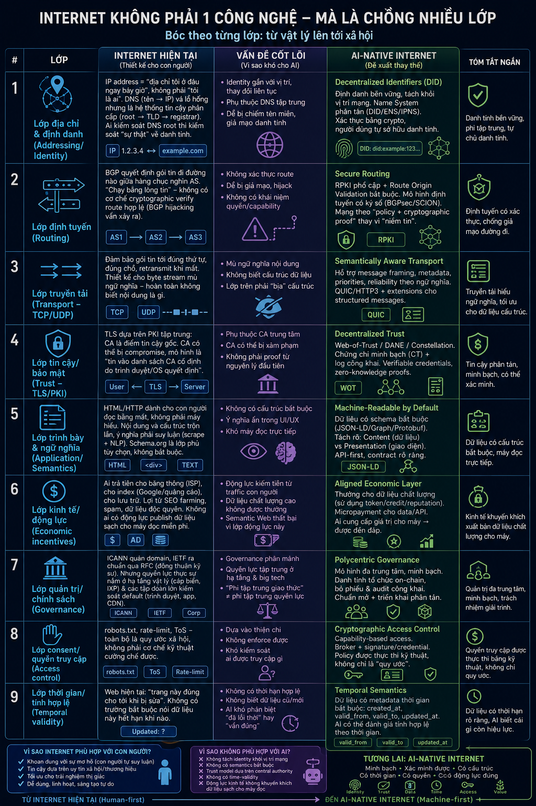

# AeroNet — lớp kết nối dành cho kỷ nguyên Agent

Internet ngày nay được xây dựng để kết nối **thiết bị**, phân phối **trang web**
và trình bày thông tin cho **con người**. Trong khi đó, AI agent cần nhận diện
lẫn nhau, trao đổi dữ liệu có cấu trúc, chứng minh nguồn gốc, thương lượng quyền
truy cập và phối hợp để hoàn thành mục tiêu.

**AeroNet** là một thử nghiệm bằng Rust nhằm xây dựng lớp kết nối đó. Dự án
không thay thế cáp quang, TCP/IP hay Internet vật lý. Nó bắt đầu từ việc bổ sung
những lớp mà một mạng lưới machine-first cần có: danh tính tự chủ, thông điệp có
ngữ nghĩa, quyền hạn kiểm chứng được, thời hạn dữ liệu và dấu vết kiểm toán.



## Internet hiện tại đang thiếu điều gì?

Internet không phải một công nghệ đơn lẻ mà là nhiều lớp được phát triển qua
nhiều thập kỷ. Các lớp ấy đã phục vụ con người rất tốt, nhưng nhiều giả định nền
tảng không còn phù hợp khi bên giao tiếp là những agent tự hành.

### Danh tính bị gắn với vị trí

IP mô tả nơi một tiến trình đang xuất hiện; DNS ánh xạ tên tới vị trí đó. Cả hai
không chứng minh được chủ thể đang giao tiếp thực sự là ai. Với agent chạy trong
container ngắn hạn, di chuyển giữa nhiều cloud hoặc hoạt động thay mặt người
dùng, địa chỉ có thể đổi liên tục nhưng danh tính cần phải bền vững.

### Đường truyền chỉ hiểu byte, không hiểu mục đích

TCP và UDP vận chuyển dữ liệu mà không biết đó là một yêu cầu, lời đề xuất, bằng
chứng hay kết quả. HTTP chủ yếu mô tả thao tác lên resource, không mô tả đầy đủ
mục tiêu, ràng buộc, ngân sách và deadline của một nhiệm vụ. Mỗi ứng dụng vì thế
phải tự xây lại ngữ nghĩa và quy tắc phối hợp ở phía trên.

### Niềm tin còn tập trung và khó kiểm toán

TLS bảo vệ đường truyền nhưng phụ thuộc vào hệ thống CA. Nó không trả lời được
agent đã được ai ủy quyền, dữ liệu đến từ nguồn nào, đã đi qua những relay nào,
hay nội dung có bị thay đổi sau khi rời bên gửi hay không. Khi agent có thể tự ra
quyết định, “kết nối được” chưa đồng nghĩa với “đủ tin cậy để hành động”.

### Dữ liệu được trình bày cho mắt người

Phần lớn Web xoay quanh HTML, giao diện và văn bản tự do. Agent phải suy luận lại
cấu trúc qua scraping hoặc NLP, dễ mất ngữ cảnh và provenance. Dữ liệu cũng hiếm
khi bắt buộc khai báo thời gian hiệu lực, khiến một fact đúng hôm qua có thể tiếp
tục được sử dụng như thể vẫn đúng hôm nay.

### Quyền truy cập dựa nhiều vào quy ước

`robots.txt`, điều khoản sử dụng và rate limit thường là chính sách ở tầng ứng
dụng. Chúng khó di chuyển theo dữ liệu và khó chứng minh giữa nhiều tổ chức.
Agent cần quyền hạn có thể kiểm tra bằng mật mã: ai cấp, cấp cho ai, được làm gì,
với resource nào, trong bao lâu và bao nhiêu lần.

### Động lực kinh tế chưa hướng tới dữ liệu machine-readable

Web hiện tại thưởng cho lượt xem, quảng cáo và thời gian chú ý của con người.
Nhà cung cấp ít động lực để xuất bản dữ liệu sạch, có schema và provenance cho
máy. Một nền kinh tế agent cần khả năng định giá theo dữ liệu, công cụ hoặc tác
vụ thực sự được sử dụng.

## Vì sao AeroNet được khởi đầu?

AeroNet bắt đầu từ một câu hỏi nhỏ: **nếu agent là công dân hạng nhất của mạng,
chúng cần giao tiếp với nhau như thế nào?**

Thay vì buộc mọi agent phải biết trước địa chỉ, API đặc thù và định dạng riêng
của mọi agent khác, AeroNet hướng tới một lớp kết nối linh hoạt hơn:

- Danh tính được sinh từ public key và không đổi khi endpoint thay đổi.
- Mỗi message tự mang schema, mục đích, thời hạn, provenance và chữ ký.
- Task mô tả kết quả mong muốn cùng constraint, budget và deadline, thay vì chỉ
  là một lệnh gọi endpoint cứng nhắc.
- Bên nhận cấp capability cụ thể; relay có thể cưỡng chế quyền trước khi chuyển
  message.
- Knowledge object khai báo ontology và thời gian hiệu lực để bên nhận biết dữ
  liệu có còn phù hợp hay không.
- Audit trail cho phép con người hoặc agent khác kiểm tra lại cuộc trao đổi.

Đích đến là một mạng nơi agent có thể được tìm thấy, xác thực, kết nối và phối
hợp dù đang chạy ở đâu hoặc dùng model nào. AeroNet hiện mới là hạt giống cho
hướng đi đó, không phải tuyên bố đã giải xong toàn bộ Internet AI-native.

## Nền tảng hiện có

| Thành phần | Vai trò |
|---|---|
| Agent DID | `did:aeronet:<base58(sha256(ed25519_public_key))>`, tách danh tính khỏi địa chỉ mạng |
| Challenge-response | Broker chỉ đăng ký endpoint sau khi agent chứng minh quyền giữ private key |
| Signed envelope | Message có schema, sender, recipient, intent, TTL, payload và chữ ký Ed25519 |
| Capability token | Giới hạn grantee, audience, action, thời hạn và tổng số message |
| Task contract | Goal, constraints, compute budget, deadline và output schema |
| Knowledge object | Dữ liệu có ontology, confidence, `valid_from`, `valid_until` và `superseded_by` |
| Durable store | SQLite WAL lưu replay state, capability usage và hàng đợi offline |
| Broker | Resolver/relay, xác minh policy, khôi phục pending message và ghi audit JSONL |
| Agent runtime | Signed delivery ACK, adapter Anthropic và chế độ `echo` |

```text
src/
├── identity.rs       DID, key storage, ký và xác minh Ed25519
├── capability.rs     capability token
├── protocol.rs       auth proof, envelope, task và knowledge object
├── storage.rs        persistent queue, replay state và capability quota
└── bin/
    ├── broker.rs     resolver/relay WebSocket + policy enforcement
    ├── agent.rs      agent runtime + model adapter
    └── key.rs        CLI tạo key và cấp token
```

## Chạy thử trên localhost

### 1. Build và tạo danh tính

```bash
cargo build
cargo run --bin aeronet-key -- generate --out alice.key.json
cargo run --bin aeronet-key -- generate --out bob.key.json
```

Mỗi lệnh `generate` sẽ in DID của agent. Gán hai giá trị đó vào shell:

```bash
ALICE_DID='did:aeronet:...'
BOB_DID='did:aeronet:...'
```

### 2. Cấp quyền hai chiều

Bob cấp cho Alice quyền gửi message tới Bob và ngược lại:

```bash
cargo run --bin aeronet-key -- issue \
  --issuer-key bob.key.json --grantee "$ALICE_DID" --out alice-to-bob.cap.json

cargo run --bin aeronet-key -- issue \
  --issuer-key alice.key.json --grantee "$BOB_DID" --out bob-to-alice.cap.json
```

### 3. Khởi động broker

```bash
RUST_LOG=info cargo run --bin broker
```

Broker mặc định nghe tại `127.0.0.1:8787`, ghi audit vào `conversation.jsonl`
và trạng thái giao nhận vào `aeronet.db`. Có thể đổi vị trí bằng
`--audit-log <path>` và `--state-db <path>`. Cả audit log lẫn hàng đợi đều tồn
tại qua lần khởi động tiếp theo.

Agent gửi task có thể kết nối trước recipient. Broker sẽ lưu task và chuyển lại
khi recipient xác thực thành công. Message chỉ rời hàng đợi sau một ACK hợp lệ.

### 4. Khởi động agent chờ

```bash
cargo run --bin agent -- \
  --key bob.key.json --peer "$ALICE_DID" \
  --capability bob-to-alice.cap.json --provider echo --max-turns 3
```

### 5. Gửi task đầu tiên

```bash
cargo run --bin agent -- \
  --key alice.key.json --peer "$BOB_DID" \
  --capability alice-to-bob.cap.json --provider echo --max-turns 3 \
  --kickoff "Đề xuất kế hoạch kiểm tra chất lượng dữ liệu" \
  --constraint "không gửi PII,chỉ dùng nguồn có provenance" \
  --budget-units 100
```

Để dùng model thật, đặt `ANTHROPIC_API_KEY`, đổi `--provider echo` thành
`--provider anthropic` và có thể truyền `--model <model-id>`.

## Giới hạn hiện tại

AeroNet hiện là MVP của lớp ứng dụng, chưa phải một mạng phân tán hoàn chỉnh:

- WebSocket demo chỉ bind localhost; payload được ký nhưng chưa mã hóa. Triển
  khai qua mạng thật cần WSS/mTLS hoặc Noise session encryption.
- Broker vẫn là resolver và relay đơn; chưa có DHT, federation, multi-hop route
  attestation hay reputation.
- Delivery hiện bảo đảm **at-least-once**; agent có ACK tự động nhưng chưa có
  scheduler retry theo backoff hoặc dead-letter queue.
- Replay state và pending queue chạy trên một SQLite node; chưa có replication,
  compaction policy hoặc đồng thuận giữa nhiều broker.
- Capability quota đã bền vững nhưng chưa có revocation registry hay delegation chain.
- Trường chi phí mới là điểm mở rộng; chưa tích hợp payment channel hoặc ledger.
- Chưa có web-of-attestation và threshold governance giữa nhiều tổ chức.

Những giới hạn này cũng xác định lộ trình tiếp theo: mã hóa mặc định, registry
federated, delivery phân tán, route có thể kiểm toán, trust đa nguồn và cơ chế
trao đổi giá trị trực tiếp giữa các agent.

## Kiểm thử

```bash
cargo fmt --all -- --check
cargo test
cargo clippy --all-targets -- -D warnings
```

Các test kiểm tra chữ ký sau khi payload bị sửa, token bị dùng bởi sai agent,
message hết hạn, replay, khôi phục queue sau restart và signed ACK.

## Cùng xây dựng AeroNet

AeroNet là dự án mã nguồn mở. Developer có thể sử dụng, nghiên cứu, sửa đổi,
phân phối và xây dựng sản phẩm dựa trên mã nguồn này theo điều khoản MIT.

Các hướng đóng góp được ưu tiên gồm mã hóa transport, DHT/registry federated,
multi-relay routing, persistent delivery, capability revocation, web-of-trust,
SDK và model adapter. Trước khi gửi thay đổi, vui lòng đọc
[CONTRIBUTING.md](CONTRIBUTING.md).

## Giấy phép

Dự án được phát hành theo [MIT License](LICENSE), bản quyền © 2026 VietChung.
Giấy phép cho phép sử dụng thương mại và phi thương mại, sao chép, chỉnh sửa,
phân phối và cấp phép lại, miễn là giữ nguyên thông báo bản quyền và giấy phép.

## Tác giả

**VietChung** · TP. Hồ Chí Minh<br>
Thời gian công bố: **20:24 (UTC−12:00)**<br>
ORCID: [0009-0005-4767-9967](https://orcid.org/0009-0005-4767-9967)

- Website: [aerovfx.com](https://aerovfx.com/)
- Facebook: [vietchung](https://facebook.com/vietchung)
- X: [@vietchung](https://x.com/vietchung)
- LinkedIn: [in/vietchung](https://www.linkedin.com/in/vietchung/)
- Hugging Face: [aerovfx](https://huggingface.co/aerovfx)

Thông tin tác giả đầy đủ được lưu tại [AUTHORS.md](AUTHORS.md).
